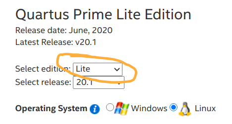
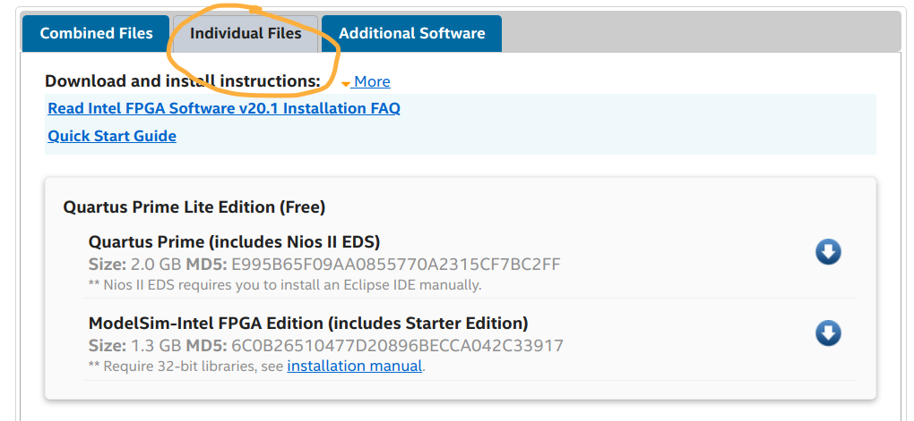

# Episode 1: Hello World

In this episode we get the tools installed and the board powered up.

## Tools
You need to download three files:
* Quartus Prime
* ModelSim-Intel FPGA Edition
* Cyclone V device support

Go to the website
[https://fpgasoftware.intel.com/](https://fpgasoftware.intel.com/) and make
sure you choose "Select edition: Lite", see below:



Next you must select "Individual Files", see below:



and then download the three files mentioned above into a temporary directory.

You should now have the following three files:
* cyclonev-20.1.0.711.qdz
* ModelSimSetup-20.1.0.711-linux.run
* QuartusLiteSetup-20.1.0.711-linux.run

Now you must make the Quartus Lite setup program has execute permissions, e.g.
by executing in the temporary download folder the following commadn:

```
chmod a+x *.run
```

Now you're ready to install. Only the Quartus Lite setup program needs to be
run. It will automatically recognize the other two files and install
everything.

## The design
This first design is trivial, and its purpose is only to get the tools
installed and working.  The DE10 Nano board has 4 slide switches and 8 LEDs. In
this first design, the four slide switches are connected to the first four
LEDs. This is seen in the design file [hello_world.vhd](hello_world.vhd).

## The Makefile
The Quartus tool is controlled by a script file, and is invoked by the command
`quartus_sh`. The command line argument `--flow compile` is an instruction to
build the complete design and geenrate a bit-file that can be programmed onto
the FPGA.

## The compile script
The file [hello_world.qsf](hello_world.qsf) contains all the build instructions.

* The `FAMILY` and `DEVICE` tags describe the particular FPGA on the DE10 Nano
  board. You should not change these, as long as you are making designs for
  this board.
* The `TOP_LEVEL_ENTITY` tag is the name of the entity. This should match the
  name defined in the file [hello_world.vhd](hello_world.vhd).
* The `PROJECT_OUTPUT_DIRECTORY` tag is not strictly necessary, but it
  instructs Quartus to place all (well, most of) its output files into a
  subdirectory (which it will create automatically).
* The `NUM_PARALLEL_PROCESSORS` tag is absolutely not necessary, but Quartus
  gives a warning if a value is not specified for this tag.
* The `VHDL_FILE` is used once for each VHDL source file.

The remaining lines instructs Quartus on which pins on the FPGA shall be
connected to the ports of the top level entity.

## Testing
To start the build simply type the command:

```
make
```

Once the build is finished, you can program the FPGA with the generated bitstream.

Then you should be able to control four of the LEDs using the four slide switches!

